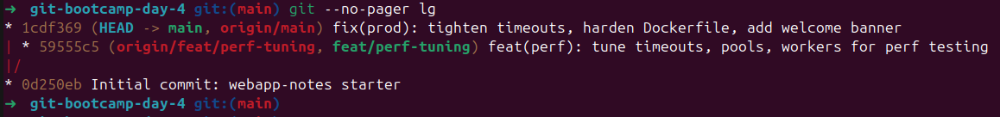
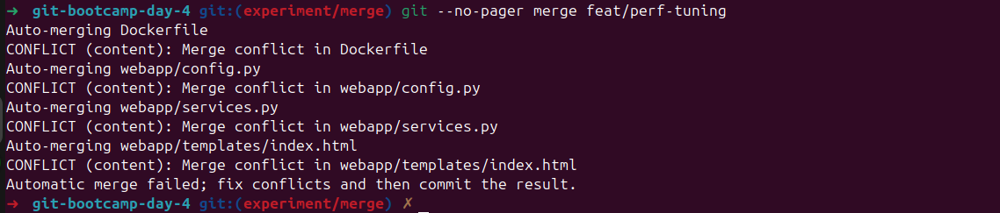
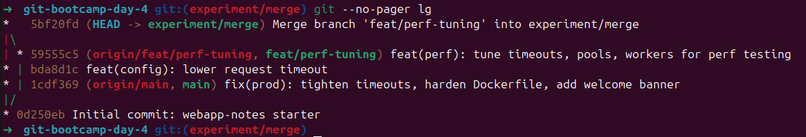
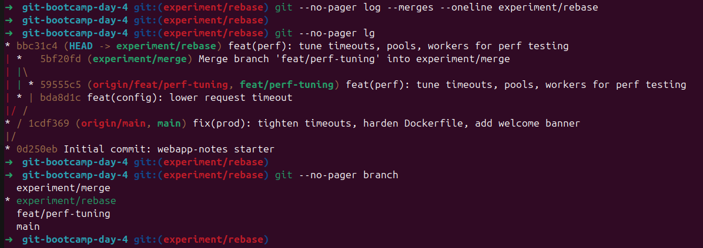
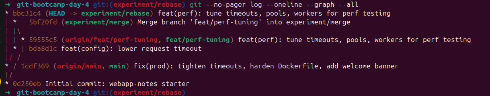
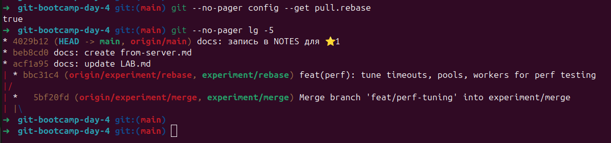
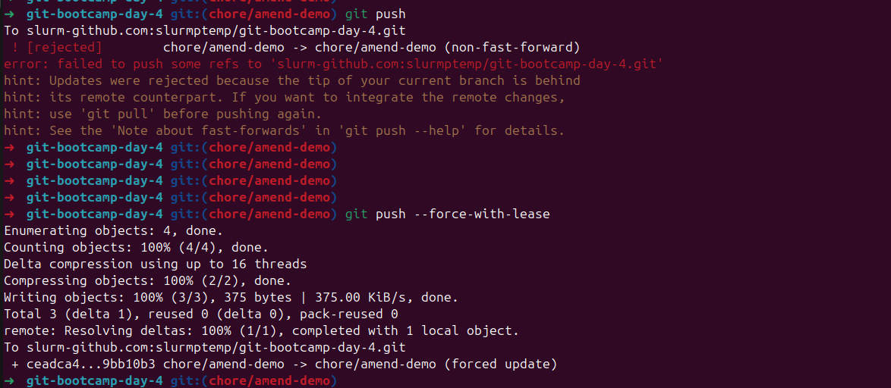

# LAB — день 4

Курс: [«Интенсив по погружению в GIT»](https://slurm.io/git-intensive)


## Базовая задача — `01-merge-vs-rebase`

### Стартовое состояние

На ветке `feat/perf-tuning`: вносили правки для подготовки проекта к тестам производительности — увеличивали таймауты, пул соединений, поднимали число воркеров gunicorn, расширяли лимит выдачи поиска, меняли блок поиска в шапке страницы и оптимизировали Dockerfile под нагрузку.

---

На ветке `main`: делали hardening для продакшена — понижение таймаутов и лимитов до консервативных, добавляли welcome-баннер на главной, ужесточали настройка безопасности в Dockerfile (запуск под non-root, явные таймауты gunicorn под short response).

---

Правки в:
- webapp/config.py — секция PerformanceSection;
- webapp/services.py — функция search_notes (логика scoring и лимиты);
- webapp/templates/index.html — блок над списком заметок;
- Dockerfile — CMD запуска gunicorn.

```bash
# git log --oneline --graph --all (на момент окончания подготовки)
* 1cdf369 (HEAD -> main) fix(prod): tighten timeouts, harden Dockerfile, add welcome banner
| * 59555c5 (origin/feat/perf-tuning, feat/perf-tuning) feat(perf): tune timeouts, pools, workers for perf testing
|/  
* 0d250eb (origin/main) Initial commit: webapp-notes starter
```



### Путь A — через `merge`

На ветке `experiment/merge`, выбран `hardening` вариант через `VS Code` ( `был добавлен лишний коммит bda8d1c, к заданию не относится, таймаут там по факту не lower, а наоборот.` ).

```bash
# git --no-pager merge feat/perf-tuning
Auto-merging Dockerfile
CONFLICT (content): Merge conflict in Dockerfile
Auto-merging webapp/config.py
CONFLICT (content): Merge conflict in webapp/config.py
Auto-merging webapp/services.py
CONFLICT (content): Merge conflict in webapp/services.py
Auto-merging webapp/templates/index.html
CONFLICT (content): Merge conflict in webapp/templates/index.html
Automatic merge failed; fix conflicts and then commit the result.


# git --no-pager lg          
*   5bf20fd (HEAD -> experiment/merge) Merge branch 'feat/perf-tuning' into experiment/merge
|\  
| * 59555c5 (origin/feat/perf-tuning, feat/perf-tuning) feat(perf): tune timeouts, pools, workers for perf testing
* | bda8d1c feat(config): lower request timeout
* | 1cdf369 (origin/main, main) fix(prod): tighten timeouts, harden Dockerfile, add welcome banner
|/  
* 0d250eb Initial commit: webapp-notes starter

```





### Путь B — через `rebase`

На ветке `experiment/rebase` , также выбран `hardening` вариант через `VS Code` ( но `REQUEST_TIMEOUT_SEC` установлен в 7 ).

```bash
# git rebase main
Auto-merging Dockerfile
CONFLICT (content): Merge conflict in Dockerfile
Auto-merging webapp/config.py
CONFLICT (content): Merge conflict in webapp/config.py
Auto-merging webapp/services.py
CONFLICT (content): Merge conflict in webapp/services.py
Auto-merging webapp/templates/index.html
CONFLICT (content): Merge conflict in webapp/templates/index.html
error: could not apply 59555c5... feat(perf): tune timeouts, pools, workers for perf testing
hint: Resolve all conflicts manually, mark them as resolved with
hint: "git add/rm <conflicted_files>", then run "git rebase --continue".
hint: You can instead skip this commit: run "git rebase --skip".
hint: To abort and get back to the state before "git rebase", run "git rebase --abort".
Could not apply 59555c5... feat(perf): tune timeouts, pools, workers for perf testing


# git --no-pager lg
* bbc31c4 (origin/experiment/rebase, experiment/rebase) feat(perf): tune timeouts, pools, workers for perf testing
| *   5bf20fd (HEAD -> experiment/merge, origin/experiment/merge) Merge branch 'feat/perf-tuning' into experiment/merge
| |\  
| | * 59555c5 (origin/feat/perf-tuning, feat/perf-tuning) feat(perf): tune timeouts, pools, workers for perf testing
| * | bda8d1c feat(config): lower request timeout
|/ /  
* / 1cdf369 (origin/main, main) fix(prod): tighten timeouts, harden Dockerfile, add welcome banner
|/  
* 0d250eb Initial commit: webapp-notes starter
```



### Сравнение

Финальная история всех веток рядом:



В процессе сравнения (например):

|Ветка|Историия|Хэши Коммитов|Видимость Ветки в истории|
|-|-|-|-|
|**experiment/merge**|С ветвлением. N-commits+merge-commit|не меняются|V|
|**experiment/rebase**|Линейная. N-commits|меняются|X|

### Какой подход я бы выбрал(а) в команде и почему

`Merge`  - например, для `Merge Request` в `master`/`main`, командная работа, явная видимость того что правки велись в отдельной ветке.
`Rebase` - локальная работа в своей ветке, чтобы "подтянуть убежавшие вперед" коммиты, сохранения линейности истории.

В примере c `merge` мы получили нелинейную историю
```bash
# git --no-pager log --decorate --oneline --graph experiment/merge 
*   5bf20fd (HEAD -> experiment/merge, origin/experiment/merge) Merge branch 'feat/perf-tuning' into experiment/merge
|\  
| * 59555c5 (origin/feat/perf-tuning, feat/perf-tuning) feat(perf): tune timeouts, pools, workers for perf testing
* | bda8d1c feat(config): lower request timeout
* | 1cdf369 (origin/main, main) fix(prod): tighten timeouts, harden Dockerfile, add welcome banner
|/  
* 0d250eb Initial commit: webapp-notes starter
```
с `rebase` наоборот
```bash
# git --no-pager log --decorate --oneline --graph experiment/rebase
* bbc31c4 (origin/experiment/rebase, experiment/rebase) feat(perf): tune timeouts, pools, workers for perf testing
* 1cdf369 (origin/main, main) fix(prod): tighten timeouts, harden Dockerfile, add welcome banner
* 0d250eb Initial commit: webapp-notes starter
```
`rebase` не содержит "лишнего" merge-коммит.
```bash
# git --no-pager log --merges --oneline experiment/rebase
#
```
`merge` наоборот
```
# git --no-pager log --merges --oneline experiment/merge 
5bf20fd (HEAD -> experiment/merge, origin/experiment/merge) Merge branch 'feat/perf-tuning' into experiment/merge
```


## Задания со звездочкой (опционально)

### ⭐1 — `git pull` vs `git pull --rebase`

Локальный коммит
```bash
* a63449e (HEAD -> main) docs: запись в NOTES для ⭐1
```
в `github ui`
```bash
* beb8cd0 (origin/main) docs: create from-server.md
```
ветка расходится и для согласования git предлагает выбрать варианты для конфигурации
```bash
➜  git-bootcamp-day-4 git:(main) git --no-pager st
On branch main
Your branch and 'origin/main' have diverged,
and have 1 and 1 different commits each, respectively.
  (use "git pull" if you want to integrate the remote branch with yours)

nothing to commit, working tree clean
➜  git-bootcamp-day-4 git:(main) 

➜  git-bootcamp-day-4 git:(main) git pull
hint: You have divergent branches and need to specify how to reconcile them.
hint: You can do so by running one of the following commands sometime before
hint: your next pull:
hint: 
hint:   git config pull.rebase false  # merge
hint:   git config pull.rebase true   # rebase
hint:   git config pull.ff only       # fast-forward only
hint: 
hint: You can replace "git config" with "git config --global" to set a default
hint: preference for all repositories. You can also pass --rebase, --no-rebase,
hint: or --ff-only on the command line to override the configured default per
hint: invocation.
fatal: Need to specify how to reconcile divergent branches.
➜  git-bootcamp-day-4 git:(main)
```
выбран вариант для merge
```bash
➜  git-bootcamp-day-4 git:(main) git --no-pager config --list |& grep pull
➜  git-bootcamp-day-4 git:(main) git --no-pager config pull.rebase false
➜  git-bootcamp-day-4 git:(main) git --no-pager config --get pull.rebase     
false
➜  git-bootcamp-day-4 git:(main) 
```
слияние выполнено через VsCode
```bash
➜  git-bootcamp-day-4 git:(main) git --no-pager pull                      
hint: Waiting for your editor to close the file... 


Merge made by the 'ort' strategy.
 from-server.md | 1 +
 1 file changed, 1 insertion(+)
 create mode 100644 from-server.md
➜  git-bootcamp-day-4 git:(main) git --no-pager lg  
*   f8aa36e (HEAD -> main) Merge branch 'main' of slurm-github.com:slurmptemp/git-bootcamp-day-4
|\  
| * beb8cd0 (origin/main) docs: create from-server.md
* | a63449e docs: запись в NOTES для ⭐1
|/  
* acf1a95 docs: update LAB.md
| * bbc31c4 (origin/experiment/rebase, experiment/rebase) feat(perf): tune timeouts, pools, workers for perf testing
|/  
| *   5bf20fd (origin/experiment/merge, experiment/merge) Merge branch 'feat/perf-tuning' into experiment/merge
| |\  
| | * 59555c5 (origin/feat/perf-tuning, feat/perf-tuning) feat(perf): tune timeouts, pools, workers for perf testing
| * | bda8d1c feat(config): lower request timeout
|/ /  
* / 1cdf369 fix(prod): tighten timeouts, harden Dockerfile, add welcome banner
|/  
* 0d250eb Initial commit: webapp-notes starter
➜  git-bootcamp-day-4 git:(main) git --no-pager st
On branch main
Your branch is ahead of 'origin/main' by 2 commits.
  (use "git push" to publish your local commits)

nothing to commit, working tree clean
➜  git-bootcamp-day-4 git:(main) 
```
затем отменён коммит слияния
```bash
➜  git-bootcamp-day-4 git:(main) git --no-pager reset --hard HEAD~1       
HEAD is now at a63449e docs: запись в NOTES для ⭐1
➜  git-bootcamp-day-4 git:(main) git --no-pager lg                 
* beb8cd0 (origin/main) docs: create from-server.md
| * a63449e (HEAD -> main) docs: запись в NOTES для ⭐1
|/  
* acf1a95 docs: update LAB.md
| * bbc31c4 (origin/experiment/rebase, experiment/rebase) feat(perf): tune timeouts, pools, workers for perf testing
|/  
| *   5bf20fd (origin/experiment/merge, experiment/merge) Merge branch 'feat/perf-tuning' into experiment/merge
| |\  
| | * 59555c5 (origin/feat/perf-tuning, feat/perf-tuning) feat(perf): tune timeouts, pools, workers for perf testing
| * | bda8d1c feat(config): lower request timeout
|/ /  
* / 1cdf369 fix(prod): tighten timeouts, harden Dockerfile, add welcome banner
|/  
* 0d250eb Initial commit: webapp-notes starter
➜  git-bootcamp-day-4 git:(main) git --no-pager st
On branch main
Your branch and 'origin/main' have diverged,
and have 1 and 1 different commits each, respectively.
  (use "git pull" if you want to integrate the remote branch with yours)

nothing to commit, working tree clean
➜  git-bootcamp-day-4 git:(main) 
```
меняем тип pull в конфиге на rebase и подтягиваем актуальные github правки, локальный коммит перемешаем после них, делаем историю линейной
```bash
➜  git-bootcamp-day-4 git:(main) git --no-pager config --get pull.rebase     
false
➜  git-bootcamp-day-4 git:(main) git --no-pager config pull.rebase true   
➜  git-bootcamp-day-4 git:(main) git --no-pager config --get pull.rebase     
true
➜  git-bootcamp-day-4 git:(main) git --no-pager pull                      
Successfully rebased and updated refs/heads/main.
➜  git-bootcamp-day-4 git:(main) git --no-pager lg                        
* 4029b12 (HEAD -> main) docs: запись в NOTES для ⭐1
* beb8cd0 (origin/main) docs: create from-server.md
* acf1a95 docs: update LAB.md
| * bbc31c4 (origin/experiment/rebase, experiment/rebase) feat(perf): tune timeouts, pools, workers for perf testing
|/  
| *   5bf20fd (origin/experiment/merge, experiment/merge) Merge branch 'feat/perf-tuning' into experiment/merge
| |\  
| | * 59555c5 (origin/feat/perf-tuning, feat/perf-tuning) feat(perf): tune timeouts, pools, workers for perf testing
| * | bda8d1c feat(config): lower request timeout
|/ /  
* / 1cdf369 fix(prod): tighten timeouts, harden Dockerfile, add welcome banner
|/  
* 0d250eb Initial commit: webapp-notes starter
➜  git-bootcamp-day-4 git:(main) 
```



### ⭐2 — `--force-with-lease` vs `--force`


команда git push, которая выдала отказ — что было в выводе;
```bash
➜  git-bootcamp-day-4 git:(chore/amend-demo) git push                                   
To slurm-github.com:slurmptemp/git-bootcamp-day-4.git
 ! [rejected]        chore/amend-demo -> chore/amend-demo (non-fast-forward)
error: failed to push some refs to 'slurm-github.com:slurmptemp/git-bootcamp-day-4.git'
hint: Updates were rejected because the tip of your current branch is behind
hint: its remote counterpart. If you want to integrate the remote changes,
hint: use 'git pull' before pushing again.
hint: See the 'Note about fast-forwards' in 'git push --help' for details.
➜  git-bootcamp-day-4 git:(chore/amend-demo) 
```
команда git push --force-with-lease, которая прошла — что было в выводе;
```bash
➜  git-bootcamp-day-4 git:(chore/amend-demo) git push --force-with-lease
Enumerating objects: 4, done.
Counting objects: 100% (4/4), done.
Delta compression using up to 16 threads
Compressing objects: 100% (2/2), done.
Writing objects: 100% (3/3), 375 bytes | 375.00 KiB/s, done.
Total 3 (delta 1), reused 0 (delta 0), pack-reused 0
remote: Resolving deltas: 100% (1/1), completed with 1 local object.
To slurm-github.com:slurmptemp/git-bootcamp-day-4.git
 + ceadca4...9bb10b3 chore/amend-demo -> chore/amend-demo (forced update)
➜  git-bootcamp-day-4 git:(chore/amend-demo) 
```
пример с `push --force`
```bash
➜  git-bootcamp-day-4 git:(chore/amend-demo) git push
To slurm-github.com:slurmptemp/git-bootcamp-day-4.git
 ! [rejected]        chore/amend-demo -> chore/amend-demo (fetch first)
error: failed to push some refs to 'slurm-github.com:slurmptemp/git-bootcamp-day-4.git'
hint: Updates were rejected because the remote contains work that you do not
hint: have locally. This is usually caused by another repository pushing to
hint: the same ref. If you want to integrate the remote changes, use
hint: 'git pull' before pushing again.
hint: See the 'Note about fast-forwards' in 'git push --help' for details.
➜  git-bootcamp-day-4 git:(chore/amend-demo) 
➜  git-bootcamp-day-4 git:(chore/amend-demo) 
➜  git-bootcamp-day-4 git:(chore/amend-demo) git push --force-with-leas
To slurm-github.com:slurmptemp/git-bootcamp-day-4.git
 ! [rejected]        chore/amend-demo -> chore/amend-demo (stale info)
error: failed to push some refs to 'slurm-github.com:slurmptemp/git-bootcamp-day-4.git'
➜  git-bootcamp-day-4 git:(chore/amend-demo) 
➜  git-bootcamp-day-4 git:(chore/amend-demo) 
➜  git-bootcamp-day-4 git:(chore/amend-demo) git push --force          
Enumerating objects: 4, done.
Counting objects: 100% (4/4), done.
Delta compression using up to 16 threads
Compressing objects: 100% (2/2), done.
Writing objects: 100% (3/3), 375 bytes | 375.00 KiB/s, done.
Total 3 (delta 1), reused 0 (delta 0), pack-reused 0
remote: Resolving deltas: 100% (1/1), completed with 1 local object.
To slurm-github.com:slurmptemp/git-bootcamp-day-4.git
 + dbc60d3...9bb10b3 chore/amend-demo -> chore/amend-demo (forced update)
➜  git-bootcamp-day-4 git:(chore/amend-demo) 
```
исходя из примеров выше:

- `--force-with-lease` безопаснее `--force` так как не затирает неподтянутые правки на remote.
Перед push проверяет, что серверный указатель ветки совпадает с `remote`.

- `--force` затирает уникальные правки на `remote` при push локального коммита.
Не проверяет `remote`.


